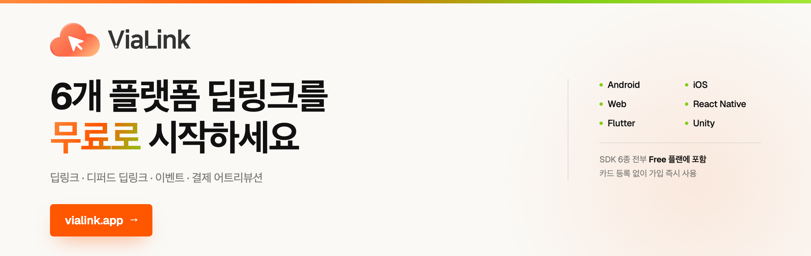

# ViaLink Flutter SDK

[](https://vialink.app)

[English](README.md) | **한국어**

ViaLink 딥링크 SDK for Flutter — 네이티브 SDK(AAR/XCFramework) 기반 브릿지 플러그인

Android · iOS 네이티브 SDK를 그대로 감싼 브릿지라, Dart 코드 한 벌로 양쪽 플랫폼의
딥링크와 디퍼드 딥링킹을 처리합니다. 앱이 없으면 스토어로 보낸 뒤 설치 후 첫 실행에서
원래 화면으로 연결하고, 클릭 → 설치 → 실행 → 이벤트 → 결제를 어트리뷰션으로 잇습니다.

많은 딥링크 · 어트리뷰션 도구가 영업 문의와 연간 계약을 요구하는 것과 달리
**ViaLink는 무료로 시작합니다.** 카드 등록 없이, 가입 즉시 6개 플랫폼 SDK를 모두 쓸 수 있습니다.

**→ [vialink.app](https://vialink.app)**

## 특징

- **딥링크 라우팅** — App Links / Universal Links 자동 처리
- **디퍼드 딥링킹** — 앱 설치 후 첫 실행 시 핑거프린트 기반 매칭
- **이벤트 추적** — 커스텀 이벤트 배치 전송
- **결제 어트리뷰션** — 결제 시도 기록 + 자동 link_id 첨부
- **링크 생성** — 앱 내에서 딥링크 생성 (static/dynamic)

## 설치

```yaml
dependencies:
  vialink_flutter_plugin: ^3.2.15
```

## 사용법

### 1. 초기화

```dart
import 'package:vialink_flutter_plugin/vialink_flutter_plugin.dart';

void main() async {
  WidgetsFlutterBinding.ensureInitialized();
  await ViaLinkSDK.instance.configure(apiKey: 'YOUR_API_KEY');
  runApp(MyApp());
}
```

### 2. 딥링크 콜백

```dart
// App Link / Universal Link 수신
ViaLinkSDK.instance.onDeepLink((data) {
  Navigator.pushNamed(context, data.path);
  print('params: ${data.params}');
});

// 디퍼드 딥링크 (첫 설치 후 매칭)
ViaLinkSDK.instance.onDeferredDeepLink((data, error) {
  if (error != null) {
    print('디퍼드 매칭 실패: ${error.message}');
    return;
  }
  if (data != null) {
    print('디퍼드 매칭 성공: ${data.path}');
    Navigator.pushNamed(context, data.path);
  } else {
    print('매칭 결과 없음 (Organic Install)');
  }
});
```

### 3. Pull API

```dart
// 동기 (캐시된 값 즉시 반환)
final deepLink = ViaLinkSDK.instance.getDeepLinkData();
final deferred = ViaLinkSDK.instance.getDeferredLinkData();

// 비동기 (결과 도착까지 대기)
final deepLinkAsync = await ViaLinkSDK.instance.awaitDeepLinkData();    // 3초 타임아웃
final deferredAsync = await ViaLinkSDK.instance.awaitDeferredLinkData(); // 결과까지 대기
```

### 4. 이벤트 추적

```dart
ViaLinkSDK.instance.track('purchase', data: {
  'product_id': '123',
  'revenue': '29900',
  'currency': 'KRW',
});
```

### 5. 결제 추적

```dart
final result = await ViaLinkSDK.instance.trackPayment(
  orderId: 'ORD-2026-0001',
  amount: 19900,
  currency: 'KRW',
  paymentMethod: 'card',
);
print('success: ${result.success}, id: ${result.paymentEventId}');
```

### 6. 링크 생성

```dart
final url = await ViaLinkSDK.instance.createLink(
  path: '/product/123',
  data: {'promo_code': 'FRIEND'},
  campaign: 'referral',
  linkType: 'dynamic', // 클릭 추적 필요 시
);
print('생성된 링크: $url');
```

## 플랫폼별 추가 설정

### Android 설정

`android/app/build.gradle`에서 `minSdkVersion 21` 이상 설정.

### iOS 설정

`ios/Runner/Info.plist`에 Associated Domains 설정:

```xml
<key>com.apple.developer.associated-domains</key>
<array>
  <string>applinks:vialink.app</string>
</array>
```

## 문서

- [SDK 가이드](https://docs.vialink.app/sdk/flutter)

## 라이선스

MIT License — Aresjoy Inc.
